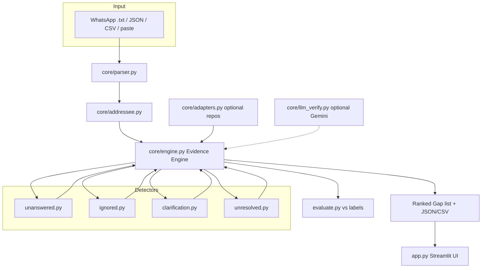

# GapDetect — Conversational Communication-Gap Analyzer

Detects **where** multi-person conversations break down — unanswered questions, ignored
direct addresses, repeated clarification requests, and unresolved topics — and shows
**exact message evidence** (id, sender, timestamp, quote) for every finding.

Works fully offline with deterministic NLP (TF-IDF, rule cues). Optional sentence-transformer
embeddings and Gemini LLM verification sit behind flags and default **OFF**.

---

## Problem

Teams lose alignment in group chats: questions go unanswered, people get ignored,
the same clarification is asked again, and decisions never land. Existing chat tools
count messages; they do not surface *communication gaps with proof*.

## Quickstart

```bash
cd gapdetect
python -m venv .venv && source .venv/bin/activate   # Windows: .venv\Scripts\activate
pip install -r requirements.txt
pytest -q                      # unit tests
python evaluate.py             # writes results.md
streamlit run app.py           # UI at http://localhost:8501
```

One-command scripts:

```bash
./run.sh          # Linux/macOS
.\run.ps1         # Windows
```

Docker:

```bash
docker build -t gapdetect .
docker run -p 8501:8501 gapdetect
```

---

## Architecture



```
gapdetect/
├── app.py                      Streamlit entry
├── evaluate.py                 Precision/Recall/F1 → results.md
├── core/
│   ├── schema.py               Message, Gap dataclasses
│   ├── config.py               ALL thresholds in one place
│   ├── parser.py               WhatsApp / JSON / CSV / paste parsers
│   ├── addressee.py            @mention, reply_to, name, previous-speaker, group
│   ├── engine.py               Evidence engine (merge, validate, score, rank)
│   ├── adapters.py             Optional parshift/groupchat-decoder/ADR wrappers
│   ├── llm_verify.py           Optional Gemini verification (strict JSON)
│   └── detectors/
│       ├── base.py             BaseDetector
│       ├── unanswered.py       Questions/requests with no answer in window
│       ├── ignored.py          Explicit addressee never engages the request
│       ├── clarification.py    Cue phrases + cosine-similar re-asks
│       └── unresolved.py       Topic threads ending without closure
├── data/                       3 labeled sample chats
├── tests/                      pytest suite
└── docs/AUDIT.md               Phase-0 reference-repo audit
```

---

## How each detector works

| Detector | Signals | Answer / gap condition |
|----------|---------|------------------------|
| **Unanswered** | `?`, wh-words, `can you`, `please send`, `can someone`, imperative requests | Look ahead N messages / M minutes for another sender with **content-word overlap** (ignoring generic time words) or a **substantive answer cue** (completion cues like `sent/done`, or volunteer cues like `i can`). Explicit `@person` requests only accept engagement from that person. |
| **Ignored** | Explicit addressee (`@mention`, `reply_to`, named participant) + directed shape | Addressee sends **nothing** in the window, or replies with **no content overlap** and no completion cue — the ask is never handled. |
| **Clarification** | Cue phrases (`what do you mean`, `can you clarify`, `didn't get`, …) | Same person re-asks; re-asks counted; **TF-IDF cosine** (or optional embeddings) flags similar question pairs above threshold. |
| **Unresolved** | Sliding-window topic clustering (shared significant tokens + TF-IDF cosine) | Topic must contain **decision language** (`decide/should/option/budget/hours/…`) and the closing region must lack **closure cues** (`done`, `decided`, `let's go with`) or social closes (`thanks`, `gn`). |

All thresholds live in [`core/config.py`](core/config.py).

---

## Evidence guarantee

The engine (`core/engine.py`) enforces:

1. **Real ids only** — any candidate citing an id not in the conversation is dropped.
2. **Exact quotes** — `evidence` is rebuilt as `[id] sender @ timestamp: text` from live messages.
3. **Dedupe** — same-type candidates sharing ≥50% message ids are merged.
4. **Severity 0..1** — blend of detector prior + time unanswered + re-ask count + people involved + deadline/decision cue words; `score_parts` exposes the breakdown.
5. **One-sentence explanation** — plain-language reason per gap.

Every gap in the UI and JSON export can be traced back to quoted messages.

---

## Results

Evaluation: `python evaluate.py` → [`results.md`](results.md).  
Prediction = correct if its message ids **overlap** a labeled gap of the **same type**.

| Config | Micro P | Micro R | Micro F1 |
|--------|--------:|--------:|---------:|
| Defaults (initial) | 0.24 | 0.65 | **0.35** |
| Tuned once (see results.md) | 0.49 | 0.86 | **0.62** |

Per-type (tuned): clarification F1 **1.00**, unresolved **0.75**, unanswered **0.50**, ignored **0.40**.

**Labels:** `data/*.labels.json` are hand-embedded gold gaps for the three sample chats.
**Please review them by hand** before treating metrics as final ground truth — casual
chats are ambiguous by nature.

---

## Optional integrations

| Feature | How | Fallback |
|---------|-----|----------|
| parshift (Gibson S/A) | `core/adapters.py` tries `import parshift`, always runs native S/A coding | Native coding — no dependency required |
| sentence-transformers | Sidebar checkbox `use_embeddings` | TF-IDF cosine for re-asks |
| Gemini verification | Sidebar checkbox + `GEMINI_API_KEY` | Gaps pass through unchanged |

---

## Limitations

- Rule + TF-IDF heuristics miss paraphrased answers with zero lexical overlap.
- Topic segmentation is greedy and can split one discussion across windows.
- WhatsApp locale formats vary; unsupported exports need JSON/CSV.
- English cue lists; multilingual chats need translated cues or embeddings.
- No user-level permission model — single-team analysis scope.

## Future work

- Slack / Microsoft Teams / Discord connectors (export APIs → `core/parser.py`)
- Streaming analysis (socket → incremental engine runs)
- Multilingual cue banks + cross-lingual embeddings
- Human-in-the-loop labeler UI to refine gold sets
- Per-thread graph views of unanswered edges

---

## Attribution — reference repositories

Audited in [`docs/AUDIT.md`](docs/AUDIT.md). None are required at runtime.

| Repository | License | Integration decision | How it appears here |
|------------|---------|----------------------|---------------------|
| [groupchat-decoder](https://github.com/tanishamalik0208/groupchat-decoder) (tanishamalik0208) | None declared | **Skip import** (JS app, no license) | Unanswered-question/action-request *idea* reimplemented in `core/detectors/unanswered.py` |
| [parshift](https://github.com/bdfsaraiva/parshift) (bdfsaraiva) | **MIT** | **Borrow logic** + optional import adapter | Gibson participation-shift S/A coding in `core/adapters.py`, feeds `ignored` detector |
| Agreement-and-Disagreement-Recognition | Not found publicly | **Skip** | Stance/disagreement cue concept folded into clarification + unresolved cue lists |

This project’s own code is MIT-licensed (see `LICENSE`). Reference-repo *names* are
credited for conceptual inspiration only; no third-party source files are vendored.

---

## License

MIT
