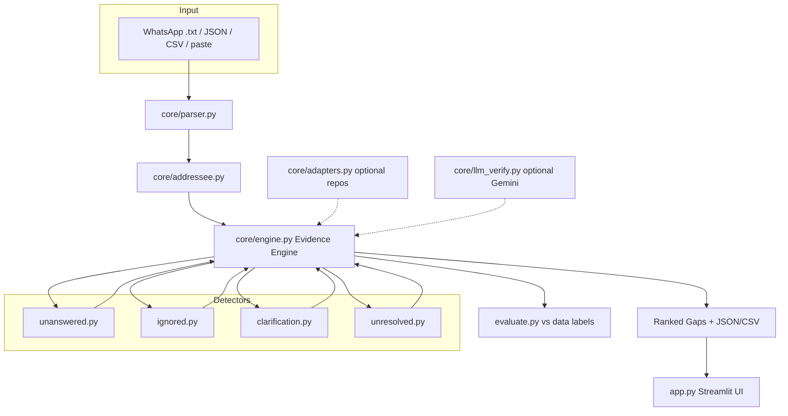

# GapDetect

**Conversational communication-gap analyzer** — finds unanswered questions, ignored
direct addresses, repeated clarification requests, and unresolved topics in multi-person
chats, with exact message evidence for every finding.

Built for the Cerebro 2026 hackathon. Works fully offline (rules + TF-IDF). Optional
sentence-transformer embeddings and Gemini verification are behind flags and default **OFF**.

---

## Table of contents

- [Problem](#problem)
- [Quickstart](#quickstart)
- [Demo (2 minutes)](#demo-2-minutes)
- [Architecture](#architecture)
- [How the detectors work](#how-the-detectors-work)
- [Evidence guarantee](#evidence-guarantee)
- [UI reference](#ui-reference)
- [Evaluation results](#evaluation-results)
- [Optional integrations](#optional-integrations)
- [Limitations](#limitations)
- [Future work](#future-work)
- [Attribution](#attribution)
- [License](#license)

---

## Problem

Group chats lose alignment constantly:

- A question is asked — nobody answers it.
- Someone is `@mentioned` — nobody responds.
- The same clarification is asked again and again.
- A decision is debated — then never closed.

Chat apps count messages. They do not show **where** communication broke down or
**prove** it with the original messages. GapDetect does both: every gap cites real
message ids, sender, timestamp, and an exact quote.

---

## Quickstart

### Local

```bash
cd gapdetect
python -m venv .venv
# Linux/macOS
source .venv/bin/activate
# Windows
.venv\Scripts\activate

pip install -r requirements.txt

pytest -q              # unit tests (20 passing)
python evaluate.py     # writes results.md
streamlit run app.py   # open http://localhost:8501
```

### One-command scripts

```bash
./run.sh      # Linux / macOS
.\run.ps1     # Windows PowerShell
```

### Docker

```bash
docker build -t gapdetect .
docker run -p 8501:8501 gapdetect
# open http://localhost:8501
```

### Python API

```python
from core.parser import parse_file
from core.engine import EvidenceEngine

messages = parse_file("data/college_project_team.txt")
result = EvidenceEngine().analyze(messages)

print(result.gaps_by_type())
for gap in result.gaps:
    print(f"[{gap.severity:.2f}] {gap.gap_type}: {gap.explanation}")
    for quote in gap.evidence:
        print("   ", quote)

print(result.to_json())  # full JSON export
```

---

## Demo (2 minutes)

Use the sample **`college_project_team`** chat (college software-project team, 53 messages, 2 days).

1. Open **http://localhost:8501**.
2. Sidebar → **Sample chat** → `college_project_team`.
3. Point at the **metric cards**: ~12 gaps, 5 participants, 53 messages.
4. Left panel: colored bars = messages inside a gap (red unanswered, orange ignored,
   blue clarification, purple unresolved).
5. Right panel: gap cards sorted by severity. Open **#41** — Dev asks Priya for the
   checkout PR link; she only says “will do”; the link never appears.
6. Open a **clarification** card (#20): Priya — *“what do you mean not sure?”*.
7. Raise **Min severity** to `0.70` → only serious gaps remain. Lower to `0.20` →
   minor gaps reappear.
8. Raise **Unanswered lookahead (msgs)** to `25` → questions get more time to be
   answered; some unanswered gaps disappear.
9. Expand **Evidence quotes** on any card → exact `[id] sender @ timestamp: text`.
10. Click **Download JSON** → full ranked report with score breakdowns.

---

## Architecture



### Project layout

```
gapdetect/
├── app.py                      Streamlit UI entry point
├── evaluate.py                 Precision / Recall / F1 → results.md
├── run.sh / run.ps1            One-command setup + run
├── Dockerfile                  Container image
├── requirements.txt
├── core/
│   ├── schema.py               Message, Gap dataclasses
│   ├── config.py               ALL thresholds in one place
│   ├── parser.py               WhatsApp / JSON / CSV / paste parsers
│   ├── addressee.py            @mention, reply_to, name, previous-speaker, group
│   ├── engine.py               Evidence engine (merge, validate, score, rank)
│   ├── adapters.py             Optional parshift / groupchat-decoder wrappers
│   ├── llm_verify.py           Optional Gemini verification (strict JSON)
│   └── detectors/
│       ├── base.py             BaseDetector ABC
│       ├── unanswered.py       Questions / requests with no answer in window
│       ├── ignored.py          Explicit addressee never engages the request
│       ├── clarification.py    Cue phrases + cosine-similar re-asks
│       └── unresolved.py       Topic threads ending without closure
├── data/
│   ├── college_project_team.txt (+ .labels.json)
│   ├── event_planning.txt      (+ .labels.json)
│   └── study_group.txt         (+ .labels.json)
├── tests/                      pytest suite (parser, addressee, detectors, engine)
├── docs/AUDIT.md               Phase-0 reference-repo audit
└── results.md                  Evaluation output
```

---

## How the detectors work

All thresholds live in **`core/config.py`**. Every detector subclasses `BaseDetector`.

### 1. Unanswered (`core/detectors/unanswered.py`)

**Finds:** questions and requests that nobody else answers in time.

**Triggers:**
- `?` in the message
- wh-words (who / what / where / when / why / how / which)
- Request phrases: `can you`, `could you`, `please send`, `can someone`, `needs to`

**Looks ahead:** configurable window (default 12 messages / 180 minutes).

**Counts as an answer only if:**
- the reply has `reply_to` pointing at the question, **or**
- the reply shares **topical content words** with the question (generic time words
  like “tomorrow” / “today” are ignored), **or**
- the reply **starts** with a substantive answer cue:
  - completion cues: `done`, `fixed`, `sent`, `here is`, `already`
  - volunteer cues: `i can`, `i will`, `let me`, `will send`, `on it`
  - status cues: `they said`, `i guess`, `supposed to`
- polar cues (`yes` / `no` / `sure`) require topical overlap — a bare “no” to an
  unrelated topic is not an answer.

**Special rule:** if the question has an explicit `@person` addressee, only that
person’s topical engagement (or a clear completion cue) counts as an answer.
A stranger’s related remark is not a fix.

**Example — `college_project_team` #41:**
> Dev: `@Priya can you please send the PR link for checkout?`
> Priya: `will do after standup` → weak cue, no content overlap → **gap**.

---

### 2. Ignored (`core/detectors/ignored.py`)

**Finds:** messages directed at a specific person who never handles the ask.

**Requires an explicit addressee** (not the soft “previous speaker” fallback):
- `@mention`
- `reply_to`
- a known participant’s name in the text

**Also requires** the message to look directed (question mark, `can you`,
`please`, `send`, `get`, …) and be at least 5 words.

**Gap when:**
- the addressee sends **nothing** in the lookahead window (default 10 messages /
  120 minutes), **or**
- they reply but with **zero content-word overlap** with the request and no
  completion cue (`done`, `sent`, `booked`, …) — the ask is never handled.

**Example — `college_project_team` #14:**
> Aanya: `@Priya please send the nginx config diff when u can`
> The config diff never appears in the chat → **gap**.

---

### 3. Repeated clarification (`core/detectors/clarification.py`)

**Two signals:**

1. **Cue phrases** — message contains one of:
   `what do you mean`, `can you clarify`, `didn't get`, `still not clear`,
   `i don't understand`, `what does that mean`, …

   Severity grows if the same person repeats the cue.

2. **Similar re-asks** — the **same person** asks another question within the
   re-ask window (default 15 messages) and TF-IDF cosine similarity between the
   two questions ≥ threshold (default 0.45).

**Example — `college_project_team` #20:**
> Priya: `what do you mean "not sure"? we need to know who broke checkout`
> Explicit cue → clarification gap. (Msg #22 Meera: `can you clarify which
> service account?` — another cue hit.)

---

### 4. Unresolved topics (`core/detectors/unresolved.py`)

**Steps:**

1. **Segment the chat into topics** — sliding-window clustering:
   messages join a topic if they share significant content tokens (length ≥ 3,
   stop-words removed) or TF-IDF cosine ≥ threshold (default 0.18). Window = 10 messages.

2. **Decide if the topic is decision-relevant** — the topic text contains
   decision language: `decide`, `should`, `option`, `budget`, `hours`,
   `agenda`, `venue`, `deadline`, `still open`, …

3. **Check the closing region** (last 3 messages of the topic):
   - closure cues present (`done`, `decided`, `let's go with`, `approved`) → resolved
   - social closes present (`thanks`, `gn`, `noted`, `bye`) → treated as wrapped up
   - **neither** → **unresolved gap**

**Example — `college_project_team` rate-limit thread:**
> Msgs #30–33: “we should move to the new gateway”, “I disagree… worse latency”,
> “both suck honestly” — decision language + disagreement, no closure cue →
> **unresolved gap**.

---

## Evidence guarantee

The engine (`core/engine.py`) enforces:

| Guarantee | How |
|-----------|-----|
| **Real ids only** | Any candidate citing an id not in the conversation is dropped |
| **Exact quotes** | `evidence` is rebuilt as `[id] sender @ timestamp: text` from live messages |
| **No duplicates** | Same-type candidates sharing ≥ 50% message ids are merged |
| **Severity 0–1** | Blend of detector prior + time unanswered + re-ask count + people involved + deadline/decision cue words |
| **Transparent scoring** | `score_parts` on every gap shows each contribution |
| **Plain explanation** | One sentence per gap saying why it was flagged |

Every gap in the UI and JSON export can be traced back to quoted messages.

---

## UI reference

### Sidebar

| Control | What it does |
|---------|----------------|
| **Source** | Sample chat / Upload `.txt` `.json` `.csv` / Paste text |
| **Sample** | Switch between the 3 built-in chats |
| **Min severity** | Hide gaps below this score (raise = stricter) |
| **Unanswered lookahead (msgs)** | How many messages to wait before calling a question unanswered |
| **Unanswered lookahead (min)** | Same, in minutes (time-based patience) |
| **Clarification similarity** | Cosine threshold for re-ask matching (raise = stricter) |
| **Ignored lookahead (msgs)** | How many messages to wait before calling a direct address ignored |
| **Embeddings** | Optional sentence-transformer re-ask detection |
| **Gemini verification** | Optional LLM double-check (needs `GEMINI_API_KEY`) |

### Main screen

- **Metric cards** — messages, participants, total gaps, per-type counts, avg severity
- **Left transcript** — full chat; gap messages highlighted with color + type badge;
  filter by type and severity
- **Right gap cards** — sorted by severity; explanation, evidence quotes, message ids,
  jump links to the transcript
- **Charts** — gaps involving participants, gaps over time, gaps by type
- **Export** — Download JSON / Download CSV

---

## Evaluation results

```bash
python evaluate.py    # → results.md
```

A prediction is correct if its message ids **overlap** a labeled gap of the **same type**.

| Config | Micro Precision | Micro Recall | Micro F1 |
|--------|----------------:|-------------:|---------:|
| Defaults (initial) | 0.24 | 0.65 | **0.35** |
| Tuned once | 0.49 | 0.86 | **0.62** |

Per-type after tuning:

| Gap type | Precision | Recall | F1 |
|----------|----------:|-------:|---:|
| Clarification | 1.00 | 1.00 | **1.00** |
| Unresolved | 0.60 | 1.00 | **0.75** |
| Unanswered | 0.38 | 0.73 | **0.50** |
| Ignored | 0.25 | 1.00 | **0.40** |

**Labels** in `data/*.labels.json` are hand-embedded gold gaps for the three sample
chats (college project team, event planning, study group). **Please review them by
hand** before treating metrics as final ground truth — casual chats are ambiguous
by nature.

Full tables: [`results.md`](results.md).

---

## Optional integrations

| Feature | Enable | Fallback if missing |
|---------|--------|---------------------|
| parshift (Gibson participation shifts) | auto-try `import parshift` | Native S/A coding in `core/adapters.py` — no dependency required |
| groupchat-decoder | not imported (JS, no license) | Unanswered-question logic reimplemented natively |
| Sentence-transformers | sidebar checkbox | TF-IDF cosine for re-asks |
| Gemini verification | sidebar checkbox + `GEMINI_API_KEY` | Gaps pass through unchanged |

---

## Limitations

- Rule + TF-IDF heuristics miss paraphrased answers with zero lexical overlap.
- Topic segmentation is greedy; one discussion can split across windows.
- English cue lists; multilingual chats need translated cues or embeddings.
- WhatsApp locale formats vary; unsupported exports should use JSON/CSV.
- Single-team analysis scope — no user-level permissions.

---

## Future work

- **Slack / Microsoft Teams / Discord connectors** (export APIs → `core/parser.py`)
- **Streaming analysis** — socket feed → incremental engine runs
- **Multilingual support** — translated cue banks + cross-lingual embeddings
- **Human-in-the-loop labeler UI** to refine gold sets
- **Thread graph views** of unanswered edges between participants
- **Follow-up draft generator** — suggest a nudge message for each unanswered gap

---

## Attribution

Reference repositories audited in [`docs/AUDIT.md`](docs/AUDIT.md). **None are required
at runtime** — the project runs with zero third-party repos installed.

| Repository | License | Decision | How it appears |
|------------|---------|----------|----------------|
| [groupchat-decoder](https://github.com/tanishamalik0208/groupchat-decoder) (tanishamalik0208) | None declared | Skip import (JS app, no license) | Unanswered-question *idea* reimplemented in `core/detectors/unanswered.py` |
| [parshift](https://github.com/bdfsaraiva/parshift) (bdfsaraiva) | **MIT** | Borrow logic + optional import adapter | Gibson S/A participation coding in `core/adapters.py`, feeds the ignored detector |
| Agreement-and-Disagreement-Recognition | Not found publicly | Skip | Stance/disagreement cue concept folded into clarification + unresolved cue lists |

This project’s code is MIT-licensed. Reference-repo names are credited for conceptual
inspiration only; no third-party source files are vendored.

---

## License

MIT — see [LICENSE](LICENSE).
